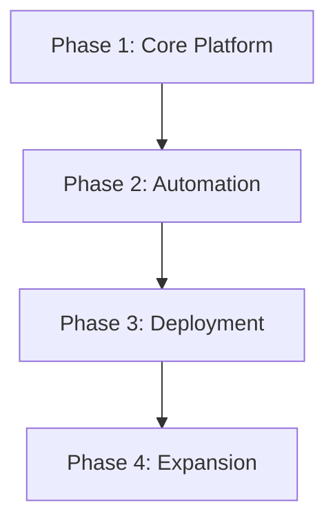
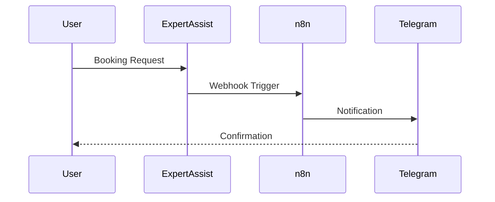

# ExpertAssist Development Roadmap

## Phase 1: Core Platform Foundation✅

### 1. Architecture Setup
- Implement Next.js (SSR/ISR) scaffold ✅
- Configure TypeScript & Tailwind ✅
- Add SEO optimization (meta tags, sitemap, robots.txt) ✅
- Set up Drizzle ORM-PostgreSQL integration ✅
- Establish CI/CD pipeline  
*Test: Full-stack smoke tests*

### 2. Database Schema Development
- Service catalog structure ✅
- User/auth models ✅
- Booking/quote tables ✅
- Analytics tracking ✅
*Test: Schema validation & relations check*

### 3. API Development
- REST endpoints for core operations ✅
- Role-based access control ✅
- Webhook infrastructure ✅
- Rate limiting ✅
*Test: Postman collection validation*

### 4. UI Component Library
- Service cards ✅
- Booking wizard ✅
- Admin dashboard ✅
- Notification system ✅
*Test: Cross-browser compatibility*

---

## Phase 2: Business Automation

### 1. AI Workflow Integration
- n8n service orchestration  
- Quote request automation  
- Basic NLP processing  
- Template response system  
*Test: Workflow success monitoring*

### 2. Telegram Integration  
- Bot configuration  
- Notification pipelines  
- Message templates  
- Delivery tracking  
*Test: Message delivery latency checks*

### 3. Form Builder  
- Drag-and-drop interface  
- Field type library  
- Response storage  
- PDF export  
*Test: Form submission E2E*

### 4. Analytics Engine  
- Booking metrics  
- Customer engagement  
- Revenue tracking  
- Basic insights  
*Test: Data accuracy audits*

---

## Phase 3: Deployment & Scaling

### 1. Infrastructure Setup  
- AWS EC2 configuration  
- Load balancing  
- Auto-scaling  
- Backup strategy  
*Test: Load testing*

### 2. CI/CD Pipeline  
- Automated testing  
- Zero-downtime deploy  
- Rollback mechanism  
- Security scanning  
*Test: Deployment dry-runs*

### 3. Security Hardening  
- Penetration testing  
- GDPR compliance  
- Payment encryption  
- Audit logging  
*Test: Vulnerability scans*

### 4. Monitoring  
- Performance metrics  
- Error tracking  
- Uptime checks  
- Alert system  
*Test: Failure simulation*

---

## Phase 4: Ecosystem Expansion

### 1. Industry Templates  
- Restaurant/retail/service  
- Customizable components  
- Preset workflows  
- Demo content  
*Test: Template usability*

### 2. Partner API Integration  
- Payment gateways  
- Map services  
- Calendar sync  
- SMS/email  
*Test: API reliability*

### 3. Documentation  
- Developer guides  
- Business user manual  
- API references  
- Troubleshooting  
*Test: Documentation accuracy*

### 4. Launch Preparation  
- Pilot program  
- Feedback system  
- Marketing site  
- Support channels  
*Test: User acceptance testing*

---

## Version History
- v0.3 (2025-03-29): Completed Phase 1 - Core Platform Foundation
- v0.2 (2025-03-27): Migrated to Next.js for SSR/SEO capabilities
- v0.1 (2025-03-27): Initial plan created
