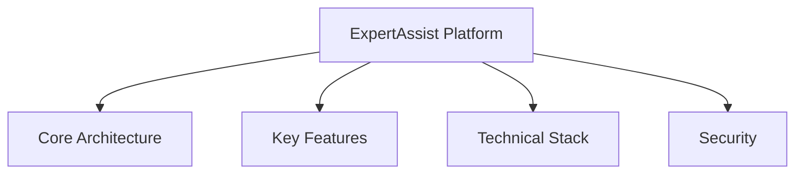
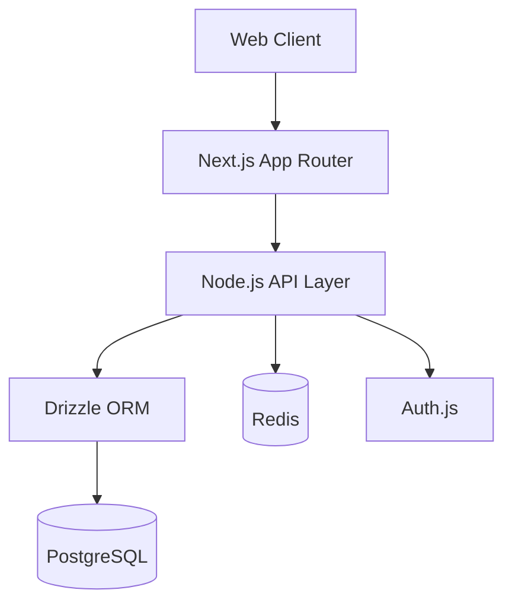
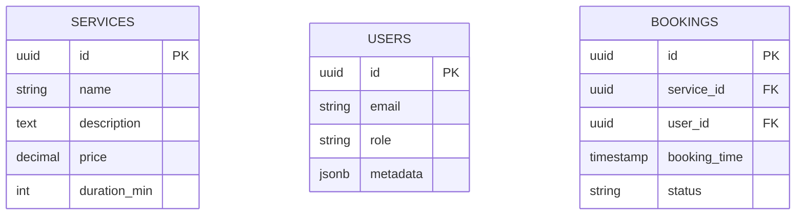
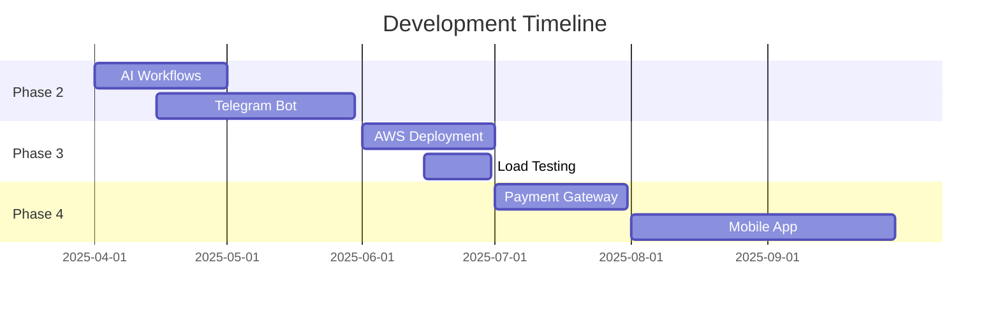

# ExpertAssist Technical Specifications

## 1. Core Architecture

## 2. Technical Stack

### Frontend
- **Framework**: Next.js 14 (App Router)
- **Language**: TypeScript 5
- **Styling**: Tailwind CSS + Shadcn UI
- **State Management**: Zustand
- **Form Handling**: React Hook Form
- **Data Fetching**: SWR

### Backend
- **Runtime**: Node.js 20
- **ORM**: Drizzle ORM
- **Database**: PostgreSQL 15
- **API Protocols**: REST/HTTP2
- **Validation**: Zod

### DevOps
- **CI/CD**: GitHub Actions
- **Containerization**: Docker
- **Monitoring**: Prometheus + Grafana
- **Logging**: ELK Stack

## 3. Core Functionalities

### Platform Foundation
- [x] SSR/ISR Page Rendering
- [x] JWT-based Authentication
- [x] Role-Based Access Control
- [x] SEO Optimization
- [x] Responsive UI Components

### Service Management
- [x] Service Catalog System
- [x] Dynamic Pricing Models
- [x] Availability Scheduling
- [x] Booking Wizard
- [x] Real-time Notifications

## 4. Database Schema Highlights

## 5. API Features
- RESTful endpoints with HATEOAS
- OAuth2.1/OpenID Connect support
- Rate limiting (1000 requests/min)
- Webhook integration points
- Automatic API documentation (Swagger)
- Request validation middleware

## 6. UI Component Library
- Service Cards with dynamic pricing
- Multi-step Booking Wizard
- Admin Dashboard with metrics
- Notification System (Toasts/Alerts)
- Responsive Data Tables
- Form Validation System

## 7. Security Implementation
- RBAC (Admin, User, Guest)
- CSRF/XSS protection
- HTTPS/TLS 1.3 enforcement
- Password hashing (Argon2id)
- Rate limiting middleware
- Sensitive data encryption

## 8. Future Roadmap

## Version History
- v1.0.0 (2025-03-29): Initial Technical Specification
- v0.3.0 (2025-03-29): Phase 1 Completion
- v0.1.0 (2025-03-27): Project Initiation

> **Note:** This document will be updated iteratively as the project progresses through development phases.
