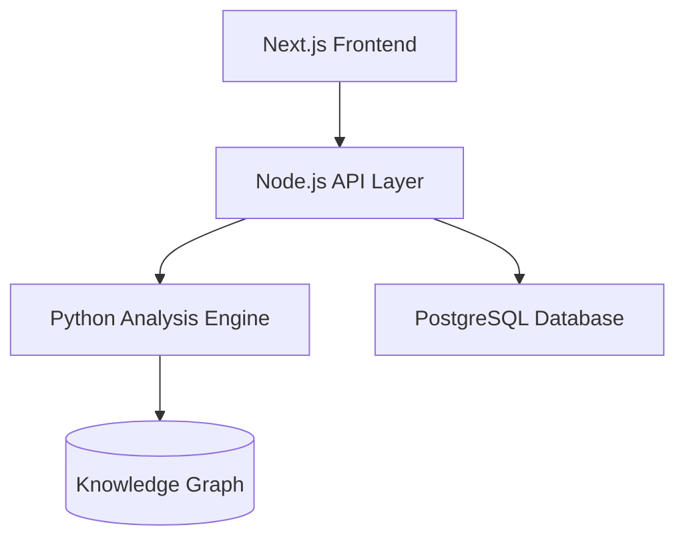

# ExpertAssist Development Plan

## Overview
ExpertAssist is an AI-powered development assistant designed to streamline software engineering workflows through intelligent automation and contextual awareness.

## Core Features
- **Project Analysis**: Automated codebase scanning and architecture visualization
- **Intelligent Refactoring**: Context-aware code improvements with safety checks
- **Workflow Automation**: CI/CD pipeline optimization and deployment guidance
- **Security Auditing**: Vulnerability detection and remediation suggestions

## Technology Stack

## Milestones
1. Phase 1: Core architecture setup (Q2 2025)
2. Phase 2: NLP integration for requirements parsing (Q3 2025)
3. Phase 3: Multi-repository dependency mapping (Q4 2025)

## Risk Management
- **Security**: Regular penetration testing
- **Performance**: Continuous load testing
- **Compliance**: GDPR/HIPAA certification roadmap
